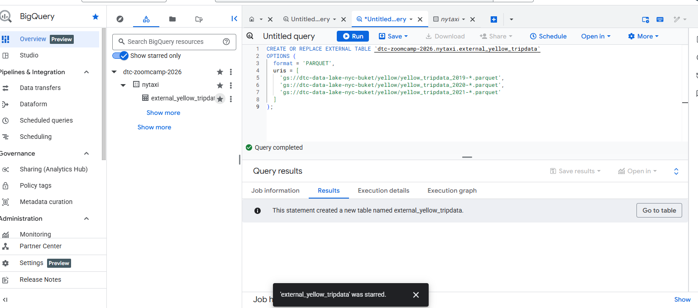
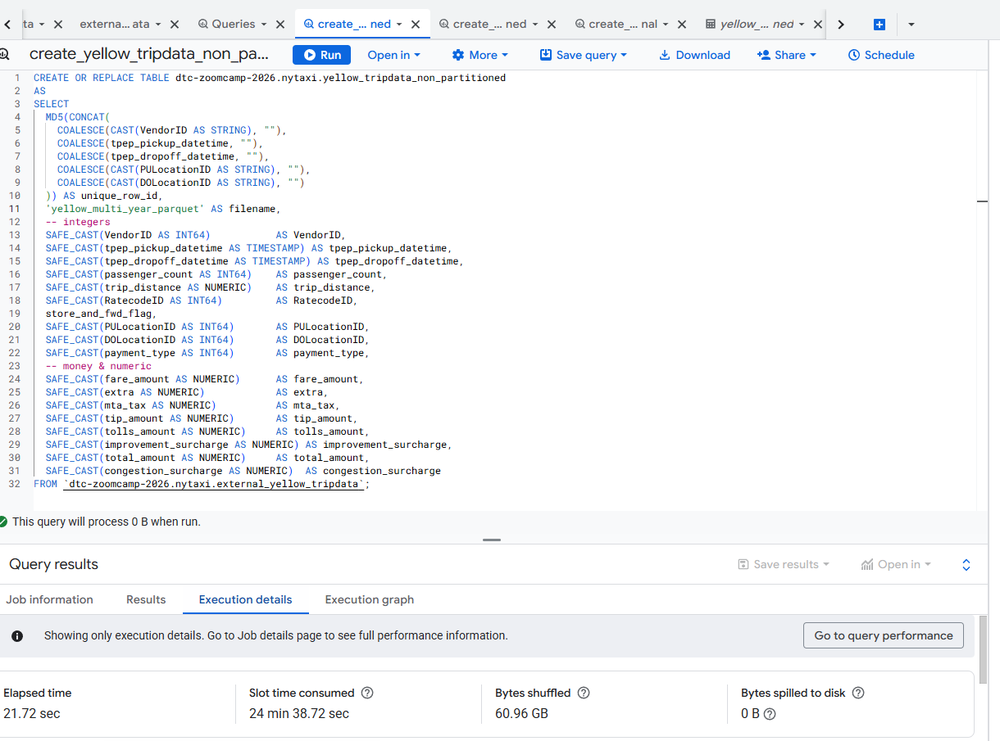
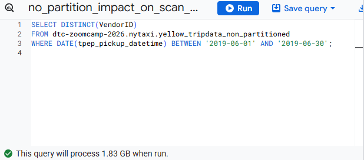
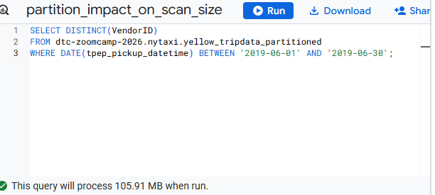
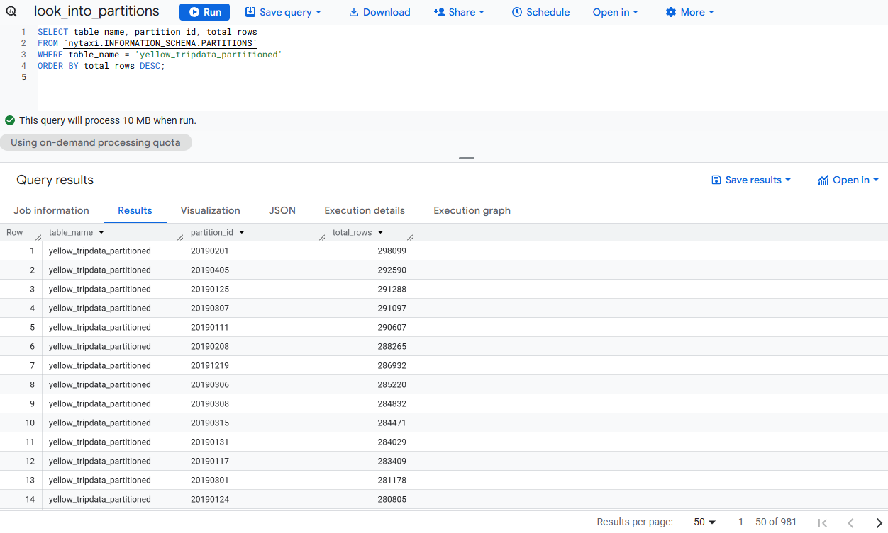
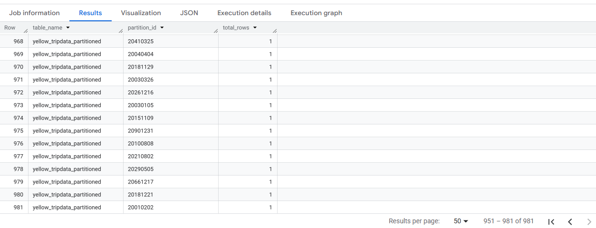
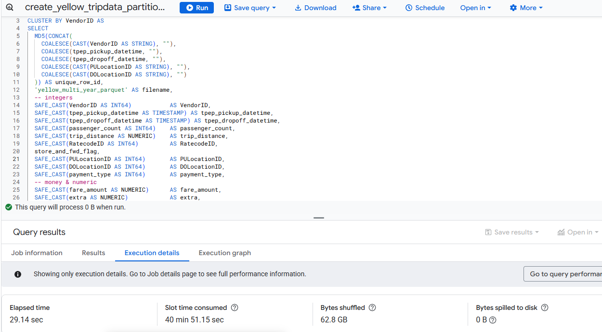
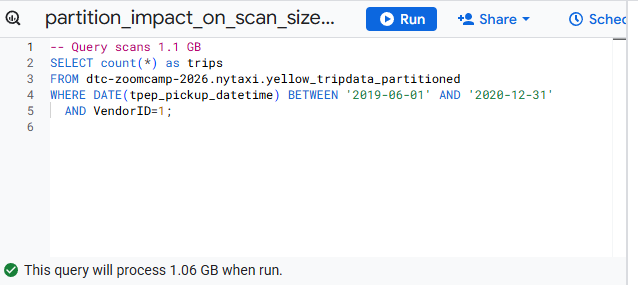
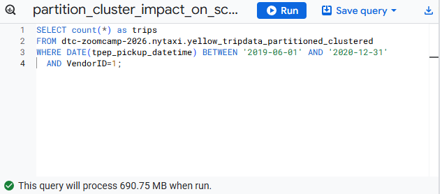

# BigQuery first tour

## Query public available table
```sql
-- Query public available table
SELECT station_id, name FROM
    bigquery-public-data.new_york_citibike.citibike_stations
LIMIT 100;
```


## Creating external table referring to gcs path
```sql
-- CREATE OR REPLACE EXTERNAL TABLE `dtc-zoomcamp-2026.nytaxi.external_yellow_tripdata`
-- OPTIONS (
--   format = 'PARQUET',
--   uris = [
--     'gs://dtc-data-lake-nyc-buket/yellow/yellow_tripdata_2019-*.parquet',
--     'gs://dtc-data-lake-nyc-buket/yellow/yellow_tripdata_2020-*.parquet',
--     'gs://dtc-data-lake-nyc-buket/yellow/yellow_tripdata_2021-*.parquet'
--   ]
-- );
```


## Best: adapted when parquet files don't have correct type directly (like String instead of timestamp)
```sql
CREATE OR REPLACE EXTERNAL TABLE `dtc-zoomcamp-2026.nytaxi.external_yellow_tripdata`
(
  VendorID INTEGER,
  tpep_pickup_datetime STRING,
  tpep_dropoff_datetime STRING,
  passenger_count INTEGER,
  trip_distance FLOAT64,
  RatecodeID INTEGER,
  store_and_fwd_flag STRING,
  PULocationID INTEGER,
  DOLocationID INTEGER,
  payment_type INTEGER,
  fare_amount FLOAT64,
  extra FLOAT64,
  mta_tax FLOAT64,
  tip_amount FLOAT64,
  tolls_amount FLOAT64,
  improvement_surcharge FLOAT64,
  total_amount FLOAT64,
  congestion_surcharge FLOAT64,
  -- ehail_fee FLOAT64, -- only exists in green_tripdata schema
  trip_type INTEGER
)
OPTIONS (
  format = 'PARQUET',
  uris = [
    'gs://dtc-data-lake-nyc-buket/yellow/yellow_tripdata_2019-*.parquet',
    'gs://dtc-data-lake-nyc-buket/yellow/yellow_tripdata_2020-*.parquet',
    'gs://dtc-data-lake-nyc-buket/yellow/yellow_tripdata_2021-*.parquet'
  ]
);
```

## Check yellow trip data

```sql
-- Check yellow trip data
SELECT * FROM dtc-zoomcamp-2026.nytaxi.external_yellow_tripdata limit 10;
```


---
# Partitions

## Create a non partitionned table from external table
```sql
-- -- Create a non partitioned table from external table
-- CREATE OR REPLACE TABLE dtc-zoomcamp-2026.nytaxi.yellow_tripdata_non_partitioned AS
-- SELECT * FROM dtc-zoomcamp-2026.nytaxi.external_yellow_tripdata;
```


### Create non partitionned table (+ cast types of external table)
```sql
CREATE OR REPLACE TABLE dtc-zoomcamp-2026.nytaxi.yellow_tripdata_non_partitioned
AS 
SELECT
  MD5(CONCAT(
    COALESCE(CAST(VendorID AS STRING), ""),
    COALESCE(tpep_pickup_datetime, ""),
    COALESCE(tpep_dropoff_datetime, ""),
    COALESCE(CAST(PULocationID AS STRING), ""),
    COALESCE(CAST(DOLocationID AS STRING), "")
  )) AS unique_row_id,
  'yellow_multi_year_parquet' AS filename,
  -- integers
  SAFE_CAST(VendorID AS INT64)           AS VendorID,
  SAFE_CAST(tpep_pickup_datetime AS TIMESTAMP) AS tpep_pickup_datetime,
  SAFE_CAST(tpep_dropoff_datetime AS TIMESTAMP) AS tpep_dropoff_datetime,
  SAFE_CAST(passenger_count AS INT64)    AS passenger_count,
  SAFE_CAST(trip_distance AS NUMERIC)    AS trip_distance,
  SAFE_CAST(RatecodeID AS INT64)         AS RatecodeID,
  store_and_fwd_flag,
  SAFE_CAST(PULocationID AS INT64)       AS PULocationID,
  SAFE_CAST(DOLocationID AS INT64)       AS DOLocationID,
  SAFE_CAST(payment_type AS INT64)       AS payment_type,
  -- money & numeric
  SAFE_CAST(fare_amount AS NUMERIC)      AS fare_amount,
  SAFE_CAST(extra AS NUMERIC)            AS extra,
  SAFE_CAST(mta_tax AS NUMERIC)          AS mta_tax,
  SAFE_CAST(tip_amount AS NUMERIC)       AS tip_amount,
  SAFE_CAST(tolls_amount AS NUMERIC)     AS tolls_amount,
  SAFE_CAST(improvement_surcharge AS NUMERIC) AS improvement_surcharge,
  SAFE_CAST(total_amount AS NUMERIC)     AS total_amount,
  SAFE_CAST(congestion_surcharge AS NUMERIC)  AS congestion_surcharge
FROM `dtc-zoomcamp-2026.nytaxi.external_yellow_tripdata`;
```

- execution time: 22 sec

### Create partitionned table by date (+ cast types of external table)
```sql
CREATE OR REPLACE TABLE dtc-zoomcamp-2026.nytaxi.yellow_tripdata_non_partitioned
PARTITION BY DATE (tpep_pickup_datetime) AS 
SELECT
  MD5(CONCAT(
    COALESCE(CAST(VendorID AS STRING), ""),
    COALESCE(tpep_pickup_datetime, ""),
    COALESCE(tpep_dropoff_datetime, ""),
    COALESCE(CAST(PULocationID AS STRING), ""),
    COALESCE(CAST(DOLocationID AS STRING), "")
  )) AS unique_row_id,
  'yellow_multi_year_parquet' AS filename,
  -- integers
  SAFE_CAST(VendorID AS INT64)           AS VendorID,
  SAFE_CAST(tpep_pickup_datetime AS TIMESTAMP) AS tpep_pickup_datetime,
  SAFE_CAST(tpep_dropoff_datetime AS TIMESTAMP) AS tpep_dropoff_datetime,
  SAFE_CAST(passenger_count AS INT64)    AS passenger_count,
  SAFE_CAST(trip_distance AS NUMERIC)    AS trip_distance,
  SAFE_CAST(RatecodeID AS INT64)         AS RatecodeID,
  store_and_fwd_flag,
  SAFE_CAST(PULocationID AS INT64)       AS PULocationID,
  SAFE_CAST(DOLocationID AS INT64)       AS DOLocationID,
  SAFE_CAST(payment_type AS INT64)       AS payment_type,
  -- money & numeric
  SAFE_CAST(fare_amount AS NUMERIC)      AS fare_amount,
  SAFE_CAST(extra AS NUMERIC)            AS extra,
  SAFE_CAST(mta_tax AS NUMERIC)          AS mta_tax,
  SAFE_CAST(tip_amount AS NUMERIC)       AS tip_amount,
  SAFE_CAST(tolls_amount AS NUMERIC)     AS tolls_amount,
  SAFE_CAST(improvement_surcharge AS NUMERIC) AS improvement_surcharge,
  SAFE_CAST(total_amount AS NUMERIC)     AS total_amount,
  SAFE_CAST(congestion_surcharge AS NUMERIC)  AS congestion_surcharge
FROM `dtc-zoomcamp-2026.nytaxi.external_yellow_tripdata`;
```

- execution time: 28 sec

## Impact of partition on scan size
### Without (1,6 Go)
```sql
-- Impact of partition
-- Scanning 1.6GB of data
SELECT DISTINCT(VendorID)
FROM dtc-zoomcamp-2026.nytaxi.yellow_tripdata_non_partitioned
WHERE DATE(tpep_pickup_datetime) BETWEEN '2019-06-01' AND '2019-06-30';
```


### With (106 Mo!)
```sql
-- Scanning ~106 MB of DATA
SELECT DISTINCT(VendorID)
FROM dtc-zoomcamp-2026.nytaxi.yellow_tripdata_partitioned
WHERE DATE(tpep_pickup_datetime) BETWEEN '2019-06-01' AND '2019-06-30';
```



## Partitions unitary size? 
```sql
-- Let's look into the partitions
SELECT table_name, partition_id, total_rows
FROM `nytaxi.INFORMATION_SCHEMA.PARTITIONS`
WHERE table_name = 'yellow_tripdata_partitioned'
ORDER BY total_rows DESC;
```


- not ordered by date (even if partitionned by date) (order means more work)
- from 300,000 for bigger partitions to 1 for smaller (partition id = date formated 20190201)

---
# Cluster

## Creating a partition and cluster table
```sql
-- -- Creating a partition and cluster table
-- CREATE OR REPLACE TABLE dtc-zoomcamp-2026.nytaxi.yellow_tripdata_partitioned_clustered
-- PARTITION BY DATE(tpep_pickup_datetime)
-- CLUSTER BY VendorID AS
-- SELECT * FROM dtc-zoomcamp-2026.nytaxi.external_yellow_tripdata;
```

```sql
-- Creating a partition and cluster table
CREATE OR REPLACE TABLE dtc-zoomcamp-2026.nytaxi.yellow_tripdata_partitioned_clustered
PARTITION BY DATE(tpep_pickup_datetime)
CLUSTER BY VendorID AS
SELECT
  MD5(CONCAT(
    COALESCE(CAST(VendorID AS STRING), ""),
    COALESCE(tpep_pickup_datetime, ""),
    COALESCE(tpep_dropoff_datetime, ""),
    COALESCE(CAST(PULocationID AS STRING), ""),
    COALESCE(CAST(DOLocationID AS STRING), "")
  )) AS unique_row_id,
  'yellow_multi_year_parquet' AS filename,
  -- integers
  SAFE_CAST(VendorID AS INT64)           AS VendorID,
  SAFE_CAST(tpep_pickup_datetime AS TIMESTAMP) AS tpep_pickup_datetime,
  SAFE_CAST(tpep_dropoff_datetime AS TIMESTAMP) AS tpep_dropoff_datetime,
  SAFE_CAST(passenger_count AS INT64)    AS passenger_count,
  SAFE_CAST(trip_distance AS NUMERIC)    AS trip_distance,
  SAFE_CAST(RatecodeID AS INT64)         AS RatecodeID,
  store_and_fwd_flag,
  SAFE_CAST(PULocationID AS INT64)       AS PULocationID,
  SAFE_CAST(DOLocationID AS INT64)       AS DOLocationID,
  SAFE_CAST(payment_type AS INT64)       AS payment_type,
  -- money & numeric
  SAFE_CAST(fare_amount AS NUMERIC)      AS fare_amount,
  SAFE_CAST(extra AS NUMERIC)            AS extra,
  SAFE_CAST(mta_tax AS NUMERIC)          AS mta_tax,
  SAFE_CAST(tip_amount AS NUMERIC)       AS tip_amount,
  SAFE_CAST(tolls_amount AS NUMERIC)     AS tolls_amount,
  SAFE_CAST(improvement_surcharge AS NUMERIC) AS improvement_surcharge,
  SAFE_CAST(total_amount AS NUMERIC)     AS total_amount,
  SAFE_CAST(congestion_surcharge AS NUMERIC)  AS congestion_surcharge
FROM `dtc-zoomcamp-2026.nytaxi.external_yellow_tripdata`;
```

- execution time: 30sec

```sql
-- Query scans 1.1 GB
SELECT count(*) as trips
FROM dtc-zoomcamp-2026.nytaxi.yellow_tripdata_partitioned
WHERE DATE(tpep_pickup_datetime) BETWEEN '2019-06-01' AND '2020-12-31'
  AND VendorID=1;
```

- scan size: 1.06 Gb

```sql
-- Query scans 864.5 MB
SELECT count(*) as trips
FROM dtc-zoomcamp-2026.nytaxi.yellow_tripdata_partitioned_clustered
WHERE DATE(tpep_pickup_datetime) BETWEEN '2019-06-01' AND '2020-12-31'
  AND VendorID=1;
```

- scan size: 691 Mb