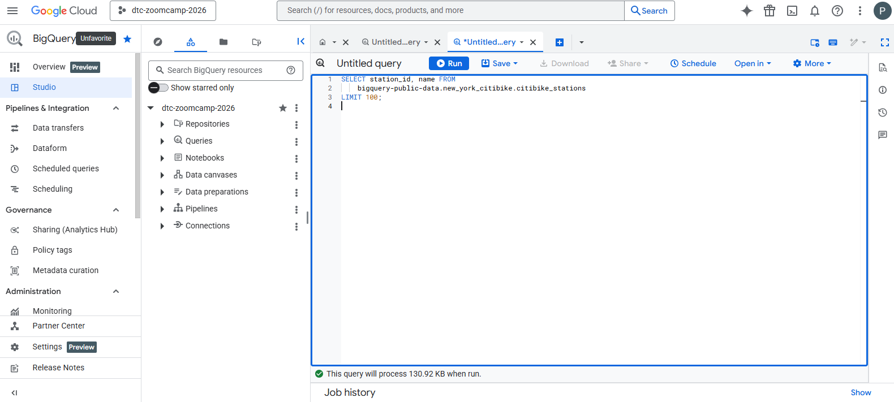
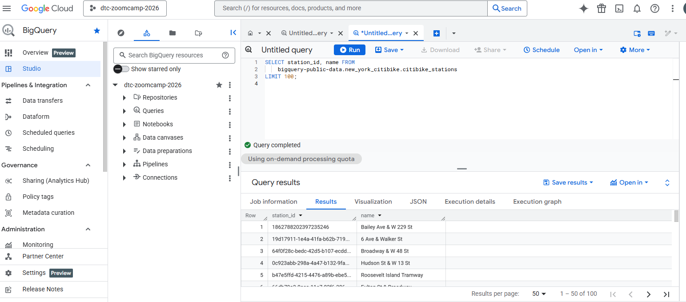
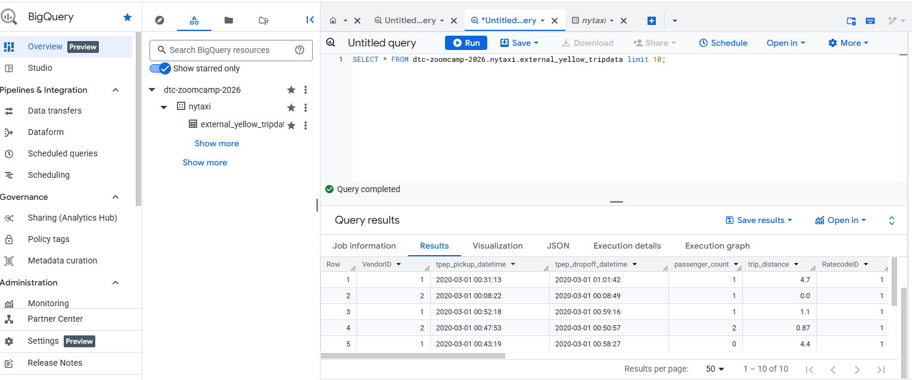

```sql
-- Query public available table
SELECT station_id, name FROM
    bigquery-public-data.new_york_citibike.citibike_stations
LIMIT 100;
```


```sql
-- Creating external table referring to gcs path
CREATE OR REPLACE EXTERNAL TABLE `dtc-zoomcamp-2026.nytaxi.external_yellow_tripdata`
OPTIONS (
  format = 'PARQUET',
  uris = [
    'gs://dtc-data-lake-nyc-buket/yellow/yellow_tripdata_2019-*.parquet',
    'gs://dtc-data-lake-nyc-buket/yellow/yellow_tripdata_2020-*.parquet',
    'gs://dtc-data-lake-nyc-buket/yellow/yellow_tripdata_2021-*.parquet'
  ]
);
```


```sql
-- Check yellow trip data
SELECT * FROM dtc-zoomcamp-2026.nytaxi.external_yellow_tripdata limit 10;
```


```sql
-- Create a non partitioned table from external table
CREATE OR REPLACE TABLE dtc-zoomcamp-2026.nytaxi.yellow_tripdata_non_partitioned AS
SELECT * FROM dtc-zoomcamp-2026.nytaxi.external_yellow_tripdata;
```


```sql
-- Create a partitioned table from external table
CREATE OR REPLACE TABLE dtc-zoomcamp-2026.nytaxi.yellow_tripdata_partitioned
PARTITION BY
  DATE(tpep_pickup_datetime) AS
SELECT * FROM dtc-zoomcamp-2026.nytaxi.external_yellow_tripdata;
```


```sql
-- Impact of partition
-- Scanning 1.6GB of data
SELECT DISTINCT(VendorID)
FROM dtc-zoomcamp-2026.nytaxi.yellow_tripdata_non_partitioned
WHERE DATE(tpep_pickup_datetime) BETWEEN '2019-06-01' AND '2019-06-30';
```


```sql
-- Scanning ~106 MB of DATA
SELECT DISTINCT(VendorID)
FROM dtc-zoomcamp-2026.nytaxi.yellow_tripdata_partitioned
WHERE DATE(tpep_pickup_datetime) BETWEEN '2019-06-01' AND '2019-06-30';
```


```sql
-- Let's look into the partitions
SELECT table_name, partition_id, total_rows
FROM `nytaxi.INFORMATION_SCHEMA.PARTITIONS`
WHERE table_name = 'yellow_tripdata_partitioned'
ORDER BY total_rows DESC;
```


```sql
-- Creating a partition and cluster table
CREATE OR REPLACE TABLE dtc-zoomcamp-2026.nytaxi.yellow_tripdata_partitioned_clustered
PARTITION BY DATE(tpep_pickup_datetime)
CLUSTER BY VendorID AS
SELECT * FROM dtc-zoomcamp-2026.nytaxi.external_yellow_tripdata;
```


```sql
-- Query scans 1.1 GB
SELECT count(*) as trips
FROM dtc-zoomcamp-2026.nytaxi.yellow_tripdata_partitioned
WHERE DATE(tpep_pickup_datetime) BETWEEN '2019-06-01' AND '2020-12-31'
  AND VendorID=1;
```


```sql
-- Query scans 864.5 MB
SELECT count(*) as trips
FROM dtc-zoomcamp-2026.nytaxi.yellow_tripdata_partitioned_clustered
WHERE DATE(tpep_pickup_datetime) BETWEEN '2019-06-01' AND '2020-12-31'
  AND VendorID=1;
```
